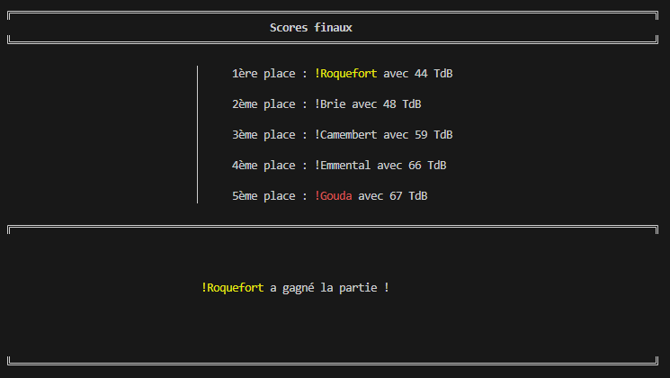
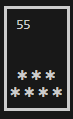
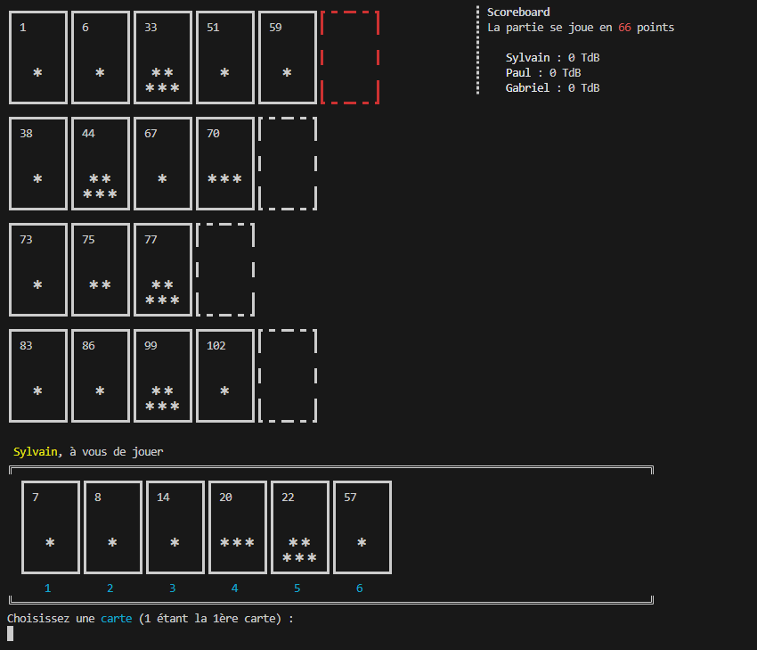
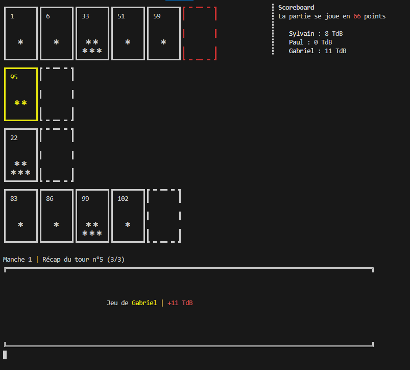

# Le 6 qui prend
Programme en C permettant de jouer au 6 qui prend dans le terminal.


## Description

Voici notre vision du 6 qui prend, un jeu de société basé sur le suspense et l'anticipation.
Le concept est simple : chaque joueur choisit astucieusement une carte de sa main et la place face cachée sur la table. Puis, simultanément, toutes les cartes sont retournées et posées sur la rangée la plus proche. Mais attention ! Si votre carte est la sixième à être posée sur une rangée, vous devrez récupérer toutes les Têtes de Boeufs (TdB)

### **Évitez les Têtes de Boeufs (TdB) !**
À la fin de la partie, le joueur avec le plus de TdB à perdu ! 
Votre but est de vous débarrasser des cartes en récoltant le moins de TdB possible !




La carte 55 possède 7 Têtes de Boeuf !
<br/><br/>


## Règles du jeu 

### Déroulement d'une manche

>Chacun son tour, les joueurs prennent une carte de leur deck.
>
>Quand tout le monde a choisi sa carte, la carte la plus faible (avec le plus petit chiffre) est la première à jouer et nous jouerons par ordre croissant.
>
>Si sa carte est inférieure à la dernière carte des rangs, alors le joueur choisit une rangée  au choix et récupère toutes les TdB de celle-ci.
>
>Si la carte est supérieure à la dernière carte des rangs, alors elle est posée automatiquement sur le plus petit intervalle.
>
>Si la carte posée est la 6ème, alors la personne récupère toutes les TdB de la rangée et la 6ème carte posée devient la première.
>
>Ce processus sera répété jusqu’à ce que les 10 cartes de chaque joueur soient épuisées.

### Condition de Victoire
Lorsque l'un des joueurs dépasse le score de TdB maximum (généralement 66) à la fin d'une manche, la partie se finit.

**Le joueur ayant le moins de TdB remporte la victoire !**
<br/><br/>

## Utilisation
Tous les terminaux n'affichent pas toujours les caractères de la même façon, voici les terminaux conseillés pour executer ce programme.
- Le terminal intégré de VSCode / VSCodium
- Le gnome-terminal de Ubuntu

```bash
git clone https://github.com/P33TheWhite/6quiPrend.git
cd 6quiprend/
make
./exe
```

### Comment jouer contre des robots ?
Pour jouer contre des robots, lors de l'entrée des pseudos des joueurs vous devrez :
- Écrire un **!** avant le pseudo du robot.
- ou appuyez sur ENTRÉE : le robot aura un pseudo pré-défini


<br/><br/>

## Visuels
&nbsp;&nbsp;&nbsp;&nbsp;&nbsp;&nbsp;
<br/><br/>

## Membres du projet
- [Sylvain Capblancq](https://github.com/Slyfti)
- [Paul Le Blanc](https://github.com/P33TheWhite)
- Gabriel Pretou
<br/><br/>
